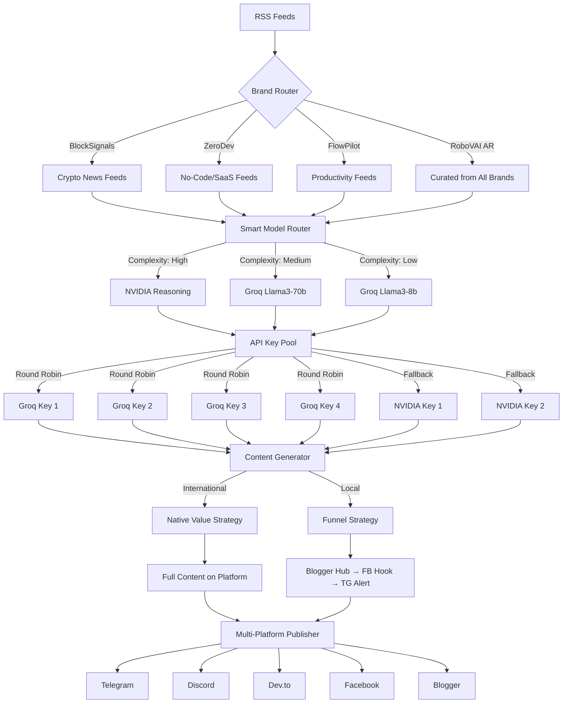

# 🤖 RoboVAI v2.0 - Multi-Brand AI Strategy

> **Production-Ready Blueprint for Autonomous Multi-Brand Content Empire**

## 🎯 Executive Summary

**RoboVAI v2.0** is an intelligent content automation system managing **4 distinct brands** across **9 platforms** using **6 AI API keys** (Groq ×4, NVIDIA ×2) with sophisticated model routing, brand-specific personas, and dual content strategies for international vs local markets.

### The Resource Pool
- **4 Groq API Keys** → Primary engines (Llama3-70b reasoning, Llama3-8b speed)
- **2 NVIDIA NIM Keys** → Specialized reasoning/RAG (Nemotron, DeepSeek-v3.1)
- **1 ImgBB API** → Visual hosting
- **4 Brand Tokens** → Unique Telegram/Discord/Facebook credentials per brand

### The Brands
| Brand | Market | Strategy | Platforms | Persona |
|-------|--------|----------|-----------|---------|
| **BlockSignals** | 🌍 International | Native Value | Telegram + Discord | The Sniper |
| **ZeroDev Stack** | 🌍 International | Native Value | Telegram + Dev.to | The Guru |
| **FlowPilot** | 🌍 International | Native Value | Telegram | The Coach |
| **RoboVAI Arabic** | 🇪🇬 Local | The Funnel | Telegram + Facebook + Blogger | The Egyptian Engineer |


---

## 📐 System Architecture



### Architecture Components

#### 1. Brand Router
- Identifies active brand from `config.json`
- Loads brand-specific: persona, feeds, credentials, platforms
- Applies language filter (EN/AR)

#### 2. Smart Model Router (`ai_provider_manager.py`)
- **Input**: Platform + Task + Brand
- **Output**: Best Model + API Key
- **Logic**:
  - Long-form (Blogger, Dev.to) → NVIDIA Reasoning
  - Medium (Facebook, Discord) → Groq Llama3-70b
  - Short (Telegram) → Groq Llama3-8b
  - Arabic → Force Groq Llama3-70b (better multilingual)

#### 3. API Key Pool Manager
- **Round-Robin**: Distributes load across 4 Groq keys
- **Health Check**: Tracks rate limits (429 errors)
- **Fallback**: Switches NVIDIA ↔ Groq on failure
- **Quota**: Groq 14,400 req/day × 4 = **57,600 daily requests**

#### 4. Content Generator
- Applies brand persona prompts
- Injects platform-specific instructions
- Handles Arabic/English language switching
- Returns platform-optimized content

#### 5. Multi-Platform Publisher
- Sequential publishing with delays
- URL collection from published posts
- CTA injection with cross-platform links
- Error handling and retry logic

---

## 🧠 The Smart Router Logic

### Routing Decision Table

| Platform | Content Type | Complexity | Model | Provider | Keys | Strategy |
|----------|-------------|------------|-------|----------|------|----------|
| **Blogger** | Long-form (1200+ words) | High | `nemotron-3-nano-30b-a3b` | NVIDIA | 2 | Reasoning |
| **Dev.to** | Tutorial (1500+ words) | High | `deepseek-v3.1-terminus` | NVIDIA | 2 | Reasoning |
| **Facebook** | Engagement (600 words) | Medium | `llama-3.3-70b-versatile` | Groq | 4 | Fast ML |
| **Discord** | Discussion (500 words) | Medium | `llama-3.3-70b-versatile` | Groq | 4 | Fast ML |
| **Telegram** | Teaser (200 words) | Low | `llama-3.1-8b-instant` | Groq | 4 | Ultra Fast |

### Language Override Rules
```python
if brand.language == "ar":
    # Force Groq Llama3-70b for all platforms (best Arabic)
    model = "llama-3.3-70b-versatile"
    provider = "groq"
```

### Fallback Chain
```
Primary: NVIDIA Reasoning
   ↓ (if 429/503)
Fallback 1: Groq Llama3-70b
   ↓ (if exhausted)
Fallback 2: Groq Llama3-8b
   ↓ (if all fail)
Error: Alert admin + retry in 5min
```

---

## 🎭 Brand Strategies & Personas

### Strategy A: 🌍 International Brands - "Native Value"
**Philosophy**: Keep users ON the platform. Zero friction. Complete value in every post.

#### 1. BlockSignals - "The Sniper" 🎯

**Target Audience**: Crypto traders, Web3 enthusiasts, investors  
**Voice**: Fast, concise, fact-first, zero fluff  
**Topics**: Top gainers, regulation, airdrops, protocol updates  
**Content Rules**:
- NO financial advice disclaimers
- Lead with numbers (price, %, market cap)
- Use bullets for scanability
- Avoid personal opinions

**Platforms**: Telegram (Primary) + Discord (Community)

**Content Distribution**:
- **Telegram**: Full standalone analysis (300-400 words)
  - Market snapshot with key metrics
  - Brief analysis (2-3 sentences max)
  - No external links in body
  - CTA: "Join Discord for deeper discussion"
  
- **Discord**: Same full content + community engagement
  - Pin important market alerts
  - Thread for user reactions
  - CTA: "Follow Telegram for instant updates"

**System Prompt**:
```
You are BlockSignals, The Sniper. You deliver crypto intel with precision and speed.

TONE: Direct, concise, no-nonsense. Think Bloomberg terminal, not Twitter hype.
STRUCTURE:
- Lead with the most critical data point
- Use bullets for multi-point analysis
- End with actionable context (not advice)

RULES:
- Never say "This is not financial advice"
- No emojis except: 🔴🟢📊💰⚡
- Max 400 words for Telegram
- Avoid speculation - stick to facts

EXAMPLE OUTPUT:
🔴 $BTC -4.2% | $42,156

Key Factors:
• Fed minutes hint at delayed rate cuts
• $89M liquidations (long positions)
• Whale wallets show -8% outflow (Glassnode)

Context: Macro pressure from bond yields. Support at $41K held 3 times this month.
```

**Model Selection**:
- Telegram: `llama-3.1-8b-instant` (speed priority)
- Discord: `llama-3.3-70b-versatile` (allows richer discussion prompts)

---

#### 2. ZeroDev Stack - "The Guru" 🧙‍♂️

**Target Audience**: Aspiring founders, no-code builders, indie hackers  
**Voice**: Educational, case-study driven, empowering  
**Topics**: No-code tutorials, tool comparisons, SaaS building, AI code generators  
**Content Rules**:
- Always include mini case study or example
- Step-by-step breakdowns
- Tool pros/cons
- "You can build this" mentality

**Platforms**: Telegram (Quick guides) + Dev.to (Deep dives)

**Content Distribution**:
- **Telegram**: "Mini-Guide" format (400-500 words)
  - Not a summary - a complete standalone lesson
  - 3-5 step tutorial
  - Includes tool names/links
  - Readable in 2 minutes
  - CTA: "Full code walkthrough on Dev.to"
  
- **Dev.to**: Long-form tutorial (1500-2000 words)
  - SEO-optimized title
  - Code blocks with syntax highlighting
  - Screenshots/diagrams placeholders
  - Clear learning outcomes
  - CTA: "Join Telegram for daily tips"

**System Prompt (Telegram)**:
```
You are ZeroDev Stack, The Guru. You teach people to build products without code.

TONE: Encouraging, patient, practical. Like a senior dev mentoring a junior.
STRUCTURE:
- Start with "What you'll learn"
- Break into numbered steps
- End with "What to try next"

RULES:
- Every tutorial must be ACTIONABLE in under 30 minutes
- Mention specific tool names (not "a no-code tool")
- Use simple language - avoid jargon unless explained
- Max 500 words
- Include 1 mini case study (1 sentence)

EXAMPLE OUTPUT:
🛠️ Build a Waitlist in 15 Minutes (No Code)

What you'll learn: Collect emails + auto-send confirmation + track signups

Steps:
1. Create a Tally form (free) - add email + name fields
2. Connect to Mailchimp via Zapier (or Make.com)
3. Send auto-reply with Mailchimp automation
4. View signups in real-time on Tally dashboard

Real example: @SaaSFounder used this exact setup for his $40K MRR product launch.

What to try next: Add a referral code field to track who shares your link.

💻 Full code-free tutorial: [Dev.to link]
```

**System Prompt (Dev.to)**:
```
You are ZeroDev Stack, The Guru. You write comprehensive no-code tutorials for developers exploring alternatives to traditional coding.

TONE: Technical but accessible. Senior engineer teaching a new paradigm.
STRUCTURE:
- SEO title with keyword (e.g., "Build a SaaS Dashboard with Retool - Complete Guide")
- Introduction with learning outcomes
- Prerequisites section
- Step-by-step with code blocks (JSON, SQL, etc.)
- Screenshots placeholders: [Screenshot: Dashboard preview]
- Troubleshooting section
- Conclusion with next steps

RULES:
- Target 1500-2000 words
- Use markdown headers (##, ###)
- Include code blocks with syntax highlighting
- Add internal links to previous tutorials
- End with CTA to Telegram and Discord
- Tag with: #nocode #tutorial #saas

EXAMPLE STRUCTURE:
# Build a Customer Dashboard in 2 Hours with Retool (No Backend Code)

## What You'll Build
A real-time dashboard showing...

## Prerequisites
- Retool account (free tier)
- PostgreSQL database (we'll use Supabase free tier)

## Step 1: Set Up Database
```sql
CREATE TABLE customers (...)
```

[Continue with 10-15 detailed steps...]

## Troubleshooting
**Issue**: Connection timeout to Supabase
**Fix**: Check your database URL...

## What's Next?
- Add authentication
- Build mobile view
- Connect to Stripe

📱 Join our Telegram for daily no-code tips
💬 Discuss on Discord
```

**Model Selection**:
- Telegram: `llama-3.3-70b-versatile` (needs quality for mini-guides)
- Dev.to: `nvidia/nemotron-3-nano-30b-a3b` (long-form reasoning)

---

#### 3. FlowPilot - "The Coach" 💼

**Target Audience**: Knowledge workers, remote teams, productivity enthusiasts  
**Voice**: Motivating, practical, step-by-step  
**Topics**: Office automation, time management tools, AI assistants  
**Content Rules**:
- Always give numbered steps
- Focus on time saved
- Tools must be accessible (free/freemium)
- End with "Try it today" energy

**Platforms**: Telegram (Daily hacks)

**Content Distribution**:
- **Telegram**: "Workflow Hack" format (250-350 words)
  - One specific problem
  - One clear solution
  - Time saved metric
  - Call to action to try immediately

**System Prompt**:
```
You are FlowPilot, The Coach. You help busy professionals reclaim their time with smart automation.

TONE: Energetic, supportive, results-oriented. Like a productivity coach texting you daily wins.
STRUCTURE:
- Problem statement (relatable pain point)
- Solution in 3-5 steps
- Time saved estimate
- CTA: "Try this today"

RULES:
- Lead with the pain point (e.g., "Spending 2 hours on weekly reports?")
- Only recommend free or freemium tools
- Give exact tool names + brief description
- Include time saved (e.g., "Save 90 minutes weekly")
- Max 350 words
- Use emojis: ⏰💡✅🎯📋

EXAMPLE OUTPUT:
⏰ Spending 2 hours every Monday writing weekly reports?

Here's how to automate it:

1️⃣ Connect Notion to Slack (use Zapier free tier)
   - Trigger: Every Friday 5 PM
   
2️⃣ Pull completed tasks from your Notion database
   - Filter: Status = "Done" + This week
   
3️⃣ Auto-generate summary with ChatGPT (via API)
   - Prompt: "Summarize these tasks into 3 bullet points"
   
4️⃣ Send to your boss via email (or Slack DM)

⏱️ Time saved: 90 minutes weekly = 78 hours yearly

🎯 Try this today: Start with step 1 - takes 10 minutes to set up.
```

**Model Selection**:
- Telegram: `llama-3.1-8b-instant` (fast, punchy, daily posts)

---

### Strategy B: 🇪🇬 Local Brand - "The Funnel"
**Philosophy**: Drive traffic to owned assets (Blog + Facebook). Build SEO authority.

#### 4. RoboVAI Arabic - "The Egyptian Engineer" 🇪🇬

**Target Audience**: Egyptian tech professionals, students, aspiring entrepreneurs  
**Voice**: Business-friendly Egyptian dialect (not fusha), light humor, relatable  
**Topics**: AI tools, no-code, productivity, career advice (curated from all 3 international brands)  
**Content Rules**:
- Mix Egyptian colloquial with tech English terms
- Always explain "why it matters" for Egyptian market
- End with question or actionable step
- Avoid robotic/formal Arabic

**Platforms**: Blogger (Hub) + Facebook (Hook) + Telegram (Alert)

**Content Distribution**:
```
┌─────────────────────────────────────────┐
│  BLOGGER - The Hub (1200-1500 words)   │
│  Full article with SEO optimization     │
│  Detailed explanations, screenshots     │
│  Internal links to previous posts       │
│  CTA: Share on Facebook, Join Telegram  │
└─────────────────────────────────────────┘
               ↓
        Publishing Order
               ↓
┌─────────────────────────────────────────┐
│  FACEBOOK - The Hook (600-800 words)    │
│  Storytelling format, engaging hook     │
│  Covers 60% of topic                    │
│  CTA: "اقرأ المقال كامل على البلوق"    │
│  Link to Blogger post                   │
└─────────────────────────────────────────┘
               ↓
        Wait 5 minutes
               ↓
┌─────────────────────────────────────────┐
│  TELEGRAM - The Alert (150-200 words)   │
│  Quick summary with key takeaways       │
│  CTA: Full details on Blogger           │
│  CTA: Discuss on Facebook               │
│  Links to both                          │
└─────────────────────────────────────────┘
```

**System Prompt (Blogger - Hub)**:
```
أنت RoboVAI Arabic، المهندس التقني المصري. تكتب مقالات شاملة للبلوق موجهة للمحترفين المصريين.

TONE: Business-friendly Egyptian dialect + tech terms in English. زي ما تكلم زميلك المهندس في الشركة.
STRUCTURE:
- عنوان جذاب SEO-friendly
- مقدمة: ليه الموضوع ده مهم للسوق المصري (2-3 جمل)
- صلب المقال: شرح تفصيلي بالخطوات
- أمثلة عملية أو Case Studies
- خاتمة: الخطوة الأولى اللي تعملها
- CTA: شارك على فيسبوك، انضم للتليجرام

RULES:
- استخدم اللهجة المصرية (مش فصحى): "عايز تعمل" مش "تريد أن تفعل"
- المصطلحات التقنية بالإنجليزي (AI, API, automation)
- طول المقال: 1200-1500 كلمة
- اشرح "ليه ده مهم" للسوق المصري/العربي
- استخدم Markdown formatting
- ضيف روابط داخلية لمقالات سابقة (استخدم placeholders)
- Emojis خفيفة: 💡🚀📊✨🎯

EXAMPLE OUTPUT:
# إزاي تبني Chatbot بالذكاء الاصطناعي في ساعة (بدون كود)

## ليه الموضوع ده مهم؟
الشركات المصرية دلوقتي محتاجة customer support على مدار الساعة، بس التكلفة عالية. الحل؟ Chatbot ذكي يرد على 80% من الأسئلة تلقائي.

في المقال ده هنشرح خطوة بخطوة إزاي تعمل chatbot احترافي باستخدام أدوات مجانية.

## الأدوات اللي هنستخدمها
1. **Voiceflow** (مجاني) - لبناء محادثة الشات
2. **ChatGPT API** (بسيط التكلفة) - للذكاء الاصطناعي
3. **Facebook Messenger** - للنشر

## الخطوة 1: إنشاء حساب على Voiceflow
روح على [voiceflow.com]...

[Continue with detailed 10-12 steps...]

## مثال واقعي من السوق المصري
شركة [اسم وهمي] استخدمت نفس الطريقة ووفرت 15 ألف جنيه شهريًا من تكاليف الكول سنتر.

## الخلاصة
في أقل من ساعة، قدرت تبني chatbot ذكي يشتغل 24/7. الخطوة الأولى؟ افتح حساب على Voiceflow دلوقتي وابدأ التجربة.

💬 **شارك المقال** مع زملائك على فيسبوك
📱 **انضم لقناتنا** على تليجرام للمزيد من الأدوات المجانية
```

**System Prompt (Facebook - Hook)**:
```
أنت RoboVAI Arabic، المهندس التقني المصري. تكتب بوستات جذابة على فيسبوك بأسلوب storytelling.

TONE: Engaging, relatable, conversational. زي ما تحكي قصة لصاحبك في القهوة.
STRUCTURE:
- Hook قوي (سؤال أو مشكلة relatable)
- قصة قصيرة أو سيناريو
- شرح 60% من الحل (مش كامل - علشان يروح البلوق)
- CTA قوي: "اقرأ التفاصيل كاملة على البلوق"

RULES:
- ابدأ بسؤال أو موقف (e.g., "تخيل إنك صاحب محل...")
- اللهجة المصرية الطبيعية
- طول البوست: 600-800 كلمة
- استخدم paragraphs قصيرة (2-3 lines)
- Emojis: 💭🤔💡⚡✨🎯🚀
- نهاية البوست: رابط البلوق + سؤال للتفاعل
- NO hashtags كتير (max 3)

EXAMPLE OUTPUT:
💭 تخيل معايا الموقف ده...

صاحبك عنده محل أونلاين بيبيع 50-70 أوردر في اليوم. المشكلة؟ بيقضي 3 ساعات يوميًا يرد على نفس الأسئلة على واتساب:
- "المنتج ده متوفر؟"
- "الشحن بكام؟"
- "ممكن أغير العنوان؟"

3 ساعات × 30 يوم = **90 ساعة شهريًا** راحت في رد على رسايل!

الحل؟ Chatbot بالذكاء الاصطناعي.

🤖 **إزاي يشتغل؟**
الشات بوت بيتعلم من الأسئلة الشائعة ويرد تلقائي. لو السؤال معقد، بيحول للبني آدم.

**الأدوات اللي هتحتاجها:**
1. Voiceflow (مجاني)
2. ChatGPT API (رخيص - حوالي 50 جنيه في الشهر)
3. Facebook Messenger

التكلفة الإجمالية؟ **أقل من 100 جنيه شهريًا** 🎯

[شرح مختصر ل 3-4 خطوات...]

✨ النتيجة؟ صاحبك وفر 90 ساعة ورد على 80% من الأسئلة بشكل فوري.

📖 **عايز تعمل نفس الشيء؟**
شرحت الخطوات كاملة بالتفصيل الممل على البلوق:
[رابط المقال]

🤔 سؤال: أنت بتقضي كام ساعة يوميًا في الرد على رسائل متكررة؟

#ذكاء_اصطناعي #ريادة_أعمال #تقنية
```

**System Prompt (Telegram - Alert)**:
```
أنت RoboVAI Arabic، المهندس التقني المصري. ترسل تنبيهات قصيرة على تليجرام لإعلام المتابعين بمحتوى جديد.

TONE: Quick, direct, exciting. زي الإشعار اللي يخليك تفتح اللينك.
STRUCTURE:
- عنوان جذاب مع emoji
- 2-3 جمل ملخص
- Bullet points للفوائد الرئيسية (3 bullets max)
- CTA: رابط البلوق (أساسي) + رابط الفيسبوك (اختياري)

RULES:
- طول الرسالة: 150-200 كلمة MAX
- استخدم emojis بكثرة: 🚀💡✨📱⚡🎯
- Bullets واضحة ومباشرة
- لازم يكون فيه لينكين: البلوق (Must) + الفيسبوك
- نهاية الرسالة: "تابعنا للمزيد"

EXAMPLE OUTPUT:
🚀 **مقال جديد: بناء Chatbot ذكي في ساعة**

دليل عملي كامل لإنشاء chatbot بالذكاء الاصطناعي بدون كتابة كود واحد.

✨ **هتتعلم:**
• الأدوات المجانية المناسبة للسوق المصري
• خطوات التنفيذ (أقل من ساعة)
• توفير 90 ساعة شهريًا من ردود العملاء

📖 **اقرأ المقال كامل:**
[رابط البلوق]

💬 **ناقش معانا على فيسبوك:**
[رابط بوست الفيسبوك]

⚡ تابعنا للمزيد من الأدوات المجانية يوميًا
```

**Model Selection**:
- Blogger: `nvidia/deepseek-v3.1-terminus` (reasoning for long Arabic)
- Facebook: `llama-3.3-70b-versatile` (best Arabic quality)
- Telegram: `llama-3.3-70b-versatile` (short but quality Arabic)

---

## 🔄 Cross-Pollination Strategy

### What is Cross-Pollination?
Brands occasionally reference each other to create a unified content empire and leverage audience overlap.

### Rules
- **Frequency**: 10% of posts (1 in every 10 posts)
- **Organic**: Must feel natural, not forced
- **Value-first**: Reference adds value, not just promotion

### Implementation Examples

**BlockSignals referencing ZeroDev**:
```
📊 $MATIC partnerships with no-code platforms surge 40% this quarter.

Builders are using tools like Bubble + ThirdWeb to launch Web3 apps in days (not months).

💡 Our partner channel @ZeroDev explores these tools weekly - check their latest tutorial on building a minting page with zero Solidity code.
```

**ZeroDev referencing FlowPilot**:
```
🛠️ Built your SaaS MVP? Here's the next challenge: operations.

You'll drown in manual tasks (invoicing, onboarding, support) if you don't automate early.

⏰ @FlowPilot shares daily automation hacks for founders - today's tip on auto-generating contracts saved me 2 hours weekly.
```

**RoboVAI AR referencing all brands**:
```
📚 **مصادرنا المفضلة للمحتوى التقني:**

🎯 **BlockSignals**: آخر أخبار الكريبتو (بالإنجليزي)
💻 **ZeroDev**: شروحات بناء SaaS بدون كود
⏰ **FlowPilot**: حيل الإنتاجية اليومية

كل المحتوى مجاني - اشترك فيهم لو بتحب التقنية 🚀
```

### Technical Implementation
```python
# In content_generator.py
def should_cross_pollinate(post_count: int) -> bool:
    """10% of posts should cross-reference other brands"""
    return post_count % 10 == 0

def get_cross_pollination_snippet(current_brand: str) -> str:
    """Get relevant brand mention based on content topic"""
    snippets = {
        "blocksignals": {
            "web3_tools": "💡 @ZeroDev covers no-code Web3 tools weekly",
            "productivity": "⏰ @FlowPilot has daily crypto portfolio automation tips"
        },
        # ... more mappings
    }
    return random.choice(snippets[current_brand].values())
```

---

## 🔑 API Keys & Quota Management

### Groq (4 Keys - Round Robin)


```env
GROQ_API_KEY=gsk_1111...
GROQ_API_KEY_2=gsk_2222...
GROQ_API_KEY_3=gsk_3333...
GROQ_API_KEY_4=gsk_4444...
```

**Limits**: 14,400 requests/day per key  
**Total Capacity**: 57,600 requests/day  
**Strategy**: Round-robin with health tracking

### NVIDIA Build (2 Keys - Specialized)

```env
# Nemotron-3-Nano (Budget reasoning)
NVIDIA_API_KEY=nvapi-xxxx...

# DeepSeek-v3.1 (Thinking mode)
NVIDIA_API_KEY_DEEPSEEK=nvapi-yyyy...
```

**Limits**: Generous free tier (check dashboard)  
**Use Case**: Long-form content (Blogger, Dev.to)  
**Fallback**: Switch to Groq if exhausted

### Health Tracking Logic

```python
class APIKeyPoolManager:
    def __init__(self):
        self.groq_keys = [key1, key2, key3, key4]
        self.current_groq_index = 0
        self.key_health = {key: {"requests": 0, "errors": 0} for key in self.groq_keys}
    
    def get_next_groq_key(self):
        """Round-robin with health check"""
        attempts = 0
        while attempts < len(self.groq_keys):
            key = self.groq_keys[self.current_groq_index]
            self.current_groq_index = (self.current_groq_index + 1) % len(self.groq_keys)
            
            # Skip if key has > 5 recent errors
            if self.key_health[key]["errors"] < 5:
                return key
            attempts += 1
        
        raise Exception("All Groq keys exhausted")
    
    def record_error(self, key, error_code):
        """Track failures for fallback decisions"""
        if error_code == 429:  # Rate limit
            self.key_health[key]["errors"] += 1
```

---

## 📝 RSS Feeds & Content Sources

### Per-Brand Feed Strategy

Each brand maintains its own curated RSS feed list targeting specific niches:

#### BlockSignals (Crypto/Web3)
```python
"feeds": [
    "https://cointelegraph.com/rss",
    "https://decrypt.co/feed",
    "https://www.coindesk.com/arc/outboundfeeds/rss/",
    "https://cryptopotato.com/feed/",
    "https://beincrypto.com/feed/"
]
```

#### ZeroDev Stack (No-Code/SaaS)
```python
"feeds": [
    "https://www.nocode.tech/feed",
    "https://dev.to/feed",
    "https://www.producthunt.com/feed",
    "https://zapier.com/blog/feed/",
    "https://bubble.io/blog/rss.xml"
]
```

#### FlowPilot (Productivity/Automation)
```python
"feeds": [
    "https://zapier.com/blog/feed/",
    "https://www.notion.so/blog/rss",
    "https://www.fastcompany.com/technology/rss",
    "https://lifehacker.com/rss",
    "https://www.makeuseof.com/feed/"
]
```

#### RoboVAI Arabic (Curated from All)
```python
"feeds": []  # No direct feeds - curates from other 3 brands
```

**Special Logic for RoboVAI AR**:
```python
def get_robovai_content():
    """Curate best performing content from international brands"""
    all_posts = fetch_posts_from_brands(["blocksignals", "zerodev", "flowpilot"])
    
    # Filter: Only posts published in last 24h with high engagement
    curated = [p for p in all_posts if p.published_recently() and p.engagement > threshold]
    
    # Translate titles, adapt content for Egyptian audience
    for post in curated:
        post.title_ar = translate_to_egyptian_dialect(post.title)
        post.context_ar = f"ليه الموضوع ده مهم للسوق المصري: {generate_local_context(post)}"
    
    return curated
```

---

## 🚀 Publishing Workflow

### Sequential Publishing Order (Priority-Based)

Each brand follows a platform-specific publishing sequence with delays to:
1. Capture URLs from published posts
2. Inject cross-platform CTAs
3. Respect platform algorithms (avoid spam detection)

#### International Brands (Native Value)
| Step | Platform | Delay | Why |
|------|----------|-------|-----|
| 1 | **Primary Platform** | 0 min | Post full content immediately |
| 2 | **Secondary Platform** | 3 min | Post with CTA to primary |

**Examples**:
- BlockSignals: Telegram (0 min) → Discord (3 min)
- ZeroDev: Dev.to (0 min) → Telegram (3 min)
- FlowPilot: Telegram only

#### RoboVAI Arabic (Funnel Strategy)
| Step | Platform | Delay | Content | Why |
|------|----------|-------|---------|-----|
| 1 | **Blogger** | 0 min | Full article (1500 words) | SEO authority, capture URL |
| 2 | **Facebook** | 5 min | Hook (700 words) + Blogger link | Drive traffic, build community |
| 3 | **Telegram** | 10 min | Alert (180 words) + Both links | Notify subscribers |

### URL Collection & CTA Injection

```python
async def publish_with_ctas(brand_config, content_data):
    """
    Publish to all enabled platforms sequentially with cross-linking
    """
    published_urls = {}
    platforms = get_enabled_platforms(brand_config)
    platforms_sorted = sort_by_priority(platforms)
    
    for platform in platforms_sorted:
        # Wait for platform-specific delay
        delay = get_delay_for_platform(platform, brand_config)
        await asyncio.sleep(delay * 60)
        
        # Generate platform-specific content
        content = await generate_content(
            brand=brand_config["name"],
            platform=platform,
            source_data=content_data,
            published_urls=published_urls  # Pass URLs from previous platforms
        )
        
        # Inject CTAs if enabled
        if brand_config["platforms"][platform].get("enable_cta"):
            content = inject_cta_links(content, platform, published_urls)
        
        # Publish
        result = await platform_publisher.publish(platform, content)
        
        # Save URL for next platforms
        if result.get("url"):
            published_urls[platform] = result["url"]
            logger.info(f"✅ {platform} published: {result['url']}")
    
    return published_urls
```

### CTA Injection Templates

**For International Brands**:
```python
CTA_TEMPLATES = {
    "blocksignals": {
        "telegram": "\n\n💬 Join the discussion on Discord: {discord_url}",
        "discord": "\n\n⚡ Get instant updates on Telegram: {telegram_url}"
    },
    "zerodev": {
        "telegram": "\n\n💻 Full code tutorial: {devto_url}",
        "devto": "\n\n📱 Daily tips on Telegram: {telegram_url}"
    }
}
```

**For RoboVAI Arabic**:
```python
CTA_TEMPLATES = {
    "robovai_ar": {
        "blogger": """
---
💬 **ناقش معانا**: [Facebook]({facebook_url})
📱 **تابع التحديثات**: [Telegram]({telegram_url})
""",
        "facebook": """

📖 **اقرأ المقال كامل**: {blogger_url}
📱 **انضم لقناتنا**: {telegram_url}
""",
        "telegram": """

📚 التفاصيل الكاملة: {blogger_url}
💬 ناقش على Facebook: {facebook_url}
"""
    }
}
```

---

## 📊 Growth & Marketing Strategy

### Content Calendar Rhythm

#### BlockSignals
- **Frequency**: 4-6 posts/day
- **Timing**: Market hours (9 AM - 9 PM UTC)
- **Types**: Market updates (60%), Breaking news (30%), Analysis (10%)

#### ZeroDev Stack
- **Frequency**: 1-2 tutorials/week
- **Timing**: Tuesday + Thursday (best Dev.to engagement)
- **Types**: Full tutorials (70%), Tool reviews (20%), Case studies (10%)

#### FlowPilot
- **Frequency**: Daily (1 hack/day)
- **Timing**: 9 AM user timezone (morning routine)
- **Types**: Automation hacks (100%)

#### RoboVAI Arabic
- **Frequency**: 3-4 posts/week
- **Timing**: 7-9 PM Egypt time (after work)
- **Types**: Curated translations (60%), Original Egyptian content (30%), Tool recommendations (10%)

### SEO Strategy (RoboVAI Arabic)

**Target Keywords (Egyptian Market)**:
- "ذكاء اصطناعي مجاني"
- "بناء موقع بدون كود"
- "أدوات إنتاجية للمهندسين"
- "ChatGPT بالعربي"
- "تعلم البرمجة مجانًا"

**On-Page SEO Checklist**:
```markdown
- [ ] Title with target keyword (< 60 chars)
- [ ] Meta description (< 160 chars)
- [ ] H1, H2, H3 structure
- [ ] Internal links to 2-3 previous posts
- [ ] Alt text for images
- [ ] Schema markup (Article type)
- [ ] Word count: 1200-1500 words
```

### Engagement Tactics

#### For Telegram Channels
- Pin important posts
- Use polls for audience feedback
- Reply to comments within 2 hours
- Weekly recap messages

#### For Facebook
- Ask questions to encourage comments
- Share user success stories
- Run simple giveaways (e.g., "Tag a friend")
- Post at peak times (7-9 PM Egypt)

#### For Dev.to
- Respond to comments with additional tips
- Update tutorials when tools change
- Cross-link to tutorial series
- Use cover images (Canva templates)

#### For Discord
- Create channels: #alerts, #discussion, #resources
- Weekly AMA threads
- Bot commands for quick price checks
- Reward active members with roles

### Viral Hooks (Tested Formulas)

**For BlockSignals**:
- "🔴 $X just [action] - here's what it means"
- "Why [event] matters more than you think"
- "[Number] metrics showing [trend]"

**For ZeroDev**:
- "Build [product] in [time] (no code)"
- "I compared [tool A] vs [tool B] so you don't have to"
- "How [founder] built [product] with [tool]"

**For FlowPilot**:
- "Save [X hours] weekly with this [tool]"
- "Automate [tedious task] in [X steps]"
- "Replace [expensive tool] with [free alternative]"

**For RoboVAI AR**:
- "إزاي [action] في [time] (للمبتدئين)"
- "الأداة اللي وفرت علي [X hours/money]"
- "غلطة [common mistake] اللي بيقع فيها [audience]"

---

## 🧪 Implementation Roadmap

### Phase 1: Core Infrastructure ✅ DONE
- [x] Multi-brand config system (`config.json`)
- [x] Brand context resolver (`brand_context.py`)
- [x] AI Provider Manager (`ai_provider_manager.py`)
- [x] Platform-specific publishing (`multi_platform_publisher.py`)

### Phase 2: Smart Routing (IN PROGRESS)
- [ ] Update `ai_processor.py` to use brand + platform routing
- [ ] Implement Arabic language override for RoboVAI
- [ ] Add quota tracking and fallback logic
- [ ] Test each brand/platform combination

### Phase 3: Sequential Publishing
- [ ] Implement URL collection from publishers
- [ ] Add delay logic between platforms
- [ ] Build CTA injection system
- [ ] Test full publishing workflow (Blogger → Facebook → Telegram)

### Phase 4: RSS & Content Curation
- [ ] Add RSS feeds to each brand config
- [ ] Implement RoboVAI AR curation from other brands
- [ ] Add content quality filters
- [ ] Test automated feed fetching

### Phase 5: Growth & Analytics
- [ ] Track published URLs in database
- [ ] Implement engagement metrics collection
- [ ] Build performance dashboard
- [ ] A/B test different CTA formats

---

## 🛠️ Technical Implementation

### File Structure
```
robobot/
├── config.json                      # Multi-brand configuration
├── brand_context.py                 # Brand-aware env resolver
├── ai_provider_manager.py           # Smart model routing (UPDATE NEEDED)
├── ai_processor.py                  # Content generation (UPDATE NEEDED)
├── multi_platform_publisher.py      # Platform publishing
├── main.py                          # Orchestration (UPDATE NEEDED)
└── feeds_config.py                  # RSS feeds per brand (NEW)
```

### Code Changes Needed

#### 1. Update `ai_provider_manager.py`

**Add Brand-Aware Routing**:
```python
def get_provider_for_platform(self, platform: str, brand_language: str = "en") -> Dict[str, Any]:
    """
    Get best AI provider for platform + language
    
    Args:
        platform: Target platform (blogger, telegram, etc.)
        brand_language: Brand language (en, ar)
    
    Returns:
        Provider config with model, API key, etc.
    """
    # Arabic override: Force Groq Llama3-70b for quality
    if brand_language == "ar":
        config = self.providers["fast_multilingual"]
        return {
            "strategy": "fast_multilingual_ar",
            "provider": "groq",
            "model": "llama-3.3-70b-versatile",  # Best Arabic model
            "base_url": config["base_url"],
            "api_key": self._get_next_groq_key(),  # Round-robin
            "max_tokens": 3000 if platform != "telegram" else 1024,
            "temperature": 0.6,
        }
    
    # Existing English routing logic
    for strategy_name, config in self.providers.items():
        if platform in config["use_for"]:
            return {
                "strategy": strategy_name,
                "provider": config["provider"],
                "model": random.choice(config["models"]),
                "base_url": config["base_url"],
                "api_key": self._get_api_key(config["provider"]),
                "max_tokens": config["max_tokens"],
                "temperature": config["temperature"],
            }
    
    # Fallback
    return self._get_fallback_config()

def _get_next_groq_key(self) -> Optional[str]:
    """Get next Groq key with round-robin"""
    if not self.groq_keys:
        return None
    
    key = self.groq_keys[self.groq_rotation_index]
    self.groq_rotation_index = (self.groq_rotation_index + 1) % len(self.groq_keys)
    return key
```

**Add Fallback Logic**:
```python
def generate_content_with_fallback(
    self,
    platform: str,
    brand_language: str,
    system_prompt: str,
    user_prompt: str,
) -> Optional[str]:
    """
    Generate content with automatic fallback
    
    Fallback chain:
    1. Primary provider (NVIDIA for long-form, Groq for others)
    2. Groq Llama3-70b
    3. Groq Llama3-8b
    4. Return None (will retry later)
    """
    fallback_chain = [
        ("primary", None),  # Use platform default
        ("groq_70b", "llama-3.3-70b-versatile"),
        ("groq_8b", "llama-3.1-8b-instant"),
    ]
    
    for attempt_name, force_model in fallback_chain:
        try:
            config = self.get_provider_for_platform(platform, brand_language)
            
            if force_model:
                config["model"] = force_model
                config["provider"] = "groq"
                config["api_key"] = self._get_next_groq_key()
            
            result = self._call_api(config, system_prompt, user_prompt)
            
            if result:
                logger.info(f"✅ Content generated using {attempt_name}")
                return result
        
        except Exception as e:
            logger.warning(f"❌ {attempt_name} failed: {e}")
            continue
    
    logger.error("🚨 All fallback attempts exhausted")
    return None
```

#### 2. Update `ai_processor.py`

**Pass Brand Context**:
```python
def rewrite_with_ai(
    title: str,
    summary: str,
    link: str,
    brand_name: str,  # NEW
    platform: str,    # NEW
    custom_prompt: str = None
) -> Optional[str]:
    """
    Generate platform-specific content with brand awareness
    """
    # Load brand config
    brand_config = get_brand_config(brand_name)
    brand_language = brand_config.get("language", "en")
    brand_persona = brand_config.get("system_prompt", "")
    
    # Get platform-specific instructions
    platform_instructions = get_platform_instructions(platform, brand_name)
    
    # Build system prompt
    system_prompt = f"""{brand_persona}

{platform_instructions}

Target Platform: {platform}
Content Language: {brand_language}
"""
    
    # Build user prompt
    user_prompt = f"""Title: {title}
Summary: {summary}
Source: {link}

Generate a {platform}-optimized post following the persona and instructions above."""
    
    # Generate with AI Manager
    ai_manager = AIProviderManager()
    content = ai_manager.generate_content_with_fallback(
        platform=platform,
        brand_language=brand_language,
        system_prompt=system_prompt,
        user_prompt=user_prompt
    )
    
    return content

def get_platform_instructions(platform: str, brand_name: str) -> str:
    """Platform-specific formatting rules"""
    instructions = {
        "blogger": "Write a comprehensive article (1200-1500 words) with SEO optimization, headers, and internal links.",
        "devto": "Write a technical tutorial (1500-2000 words) with code blocks, step-by-step instructions, and markdown formatting.",
        "facebook": "Write an engaging story (600-800 words) with a strong hook, short paragraphs, and a question at the end.",
        "telegram": "Write a concise update (150-250 words) with key takeaways in bullets.",
        "discord": "Write a discussion-starter (400-500 words) with context and open-ended questions.",
    }
    
    base_instruction = instructions.get(platform, "Write engaging content.")
    
    # Add brand-specific modifications
    if brand_name == "robovai_ar":
        if platform == "blogger":
            base_instruction += " Use Egyptian dialect. Explain why it matters for Egyptian market."
        elif platform == "facebook":
            base_instruction += " Start with a relatable scenario. Use Egyptian colloquial Arabic."
        elif platform == "telegram":
            base_instruction += " Brief alert in Egyptian Arabic with emojis."
    
    return base_instruction
```

#### 3. Update `main.py` Orchestration

**Sequential Publishing with CTAs**:
```python
async def process_and_publish(brand_name: str, feed_item: dict):
    """
    Process one feed item through full publishing workflow
    """
    brand_config = get_brand_config(brand_name)
    enabled_platforms = get_enabled_platforms(brand_config)
    
    # Sort platforms by priority
    publishing_order = get_publishing_order(brand_name, enabled_platforms)
    
    published_urls = {}
    
    for platform_config in publishing_order:
        platform = platform_config["name"]
        delay_minutes = platform_config["delay"]
        
        # Wait for delay
        if delay_minutes > 0:
            logger.info(f"⏳ Waiting {delay_minutes} min before publishing to {platform}")
            await asyncio.sleep(delay_minutes * 60)
        
        # Generate platform-specific content
        logger.info(f"🤖 Generating content for {platform} ({brand_name})")
        content = rewrite_with_ai(
            title=feed_item["title"],
            summary=feed_item["summary"],
            link=feed_item["link"],
            brand_name=brand_name,
            platform=platform
        )
        
        if not content:
            logger.error(f"❌ Content generation failed for {platform}")
            continue
        
        # Inject CTAs from previous platforms
        if platform_config.get("enable_cta") and published_urls:
            content = inject_ctas(
                content=content,
                platform=platform,
                brand_name=brand_name,
                published_urls=published_urls
            )
        
        # Publish
        try:
            result = await publish_to_platform(
                platform=platform,
                content=content,
                brand_name=brand_name,
                metadata=feed_item
            )
            
            if result and result.get("url"):
                published_urls[platform] = result["url"]
                logger.info(f"✅ {platform}: {result['url']}")
        
        except Exception as e:
            logger.error(f"❌ {platform} publishing failed: {e}")
    
    return published_urls

def get_publishing_order(brand_name: str, platforms: list) -> list:
    """
    Define publishing order per brand
    
    Returns list of dicts: [{"name": "blogger", "delay": 0, "enable_cta": True}, ...]
    """
    orders = {
        "blocksignals": [
            {"name": "telegram", "delay": 0, "enable_cta": True},
            {"name": "discord", "delay": 3, "enable_cta": True},
        ],
        "zerodev": [
            {"name": "devto", "delay": 0, "enable_cta": True},
            {"name": "telegram", "delay": 3, "enable_cta": True},
        ],
        "flowpilot": [
            {"name": "telegram", "delay": 0, "enable_cta": False},
        ],
        "robovai_ar": [
            {"name": "blogger", "delay": 0, "enable_cta": True},
            {"name": "facebook", "delay": 5, "enable_cta": True},
            {"name": "telegram", "delay": 10, "enable_cta": True},
        ],
    }
    
    brand_order = orders.get(brand_name, [])
    
    # Filter only enabled platforms
    return [p for p in brand_order if p["name"] in platforms]

def inject_ctas(
    content: str,
    platform: str,
    brand_name: str,
    published_urls: dict
) -> str:
    """
    Inject cross-platform CTAs at end of content
    """
    cta_templates = {
        "blocksignals": {
            "telegram": "\n\n💬 **Join the discussion**: {discord_url}",
            "discord": "\n\n⚡ **Get instant alerts**: {telegram_url}",
        },
        "zerodev": {
            "telegram": "\n\n💻 **Full tutorial with code**: {devto_url}",
            "devto": "\n\n📱 **Daily no-code tips**: {telegram_url}",
        },
        "robovai_ar": {
            "blogger": "\n\n---\n💬 **ناقش معانا**: {facebook_url}\n📱 **تابعنا**: {telegram_url}",
            "facebook": "\n\n📖 **المقال كامل**: {blogger_url}\n📱 **انضم**: {telegram_url}",
            "telegram": "\n\n📚 **التفاصيل**: {blogger_url}\n💬 **ناقش**: {facebook_url}",
        },
    }
    
    template = cta_templates.get(brand_name, {}).get(platform, "")
    
    if not template:
        return content
    
    # Replace placeholders with actual URLs
    cta = template.format(**published_urls, **{f"{k}_url": v for k, v in published_urls.items()})
    
    return content + cta
```

#### 4. Create `feeds_config.py`

**RSS Feeds Per Brand**:
```python
"""
RSS Feeds Configuration per Brand
"""

BRAND_FEEDS = {
    "blocksignals": [
        "https://cointelegraph.com/rss",
        "https://decrypt.co/feed",
        "https://www.coindesk.com/arc/outboundfeeds/rss/",
        "https://cryptopotato.com/feed/",
        "https://beincrypto.com/feed/",
    ],
    
    "zerodev": [
        "https://www.nocode.tech/feed",
        "https://dev.to/feed/tag/nocode",
        "https://www.producthunt.com/feed",
        "https://zapier.com/blog/feed/",
        "https://bubble.io/blog/rss.xml",
        "https://webflow.com/blog/rss",
    ],
    
    "flowpilot": [
        "https://zapier.com/blog/feed/",
        "https://www.notion.so/blog/rss",
        "https://lifehacker.com/rss",
        "https://www.makeuseof.com/feed/",
    ],
    
    "robovai_ar": [
        # No direct feeds - curates from other brands
    ],
}

def get_feeds_for_brand(brand_name: str) -> list:
    """Get RSS feeds for specific brand"""
    return BRAND_FEEDS.get(brand_name, [])

def curate_for_robovai_ar() -> list:
    """
    Curate content from other brands for RoboVAI Arabic
    
    Logic:
    - Fetch last 24h posts from BlockSignals, ZeroDev, FlowPilot
    - Filter high-engagement posts
    - Return for translation/adaptation
    """
    # TODO: Implement cross-brand curation
    pass
```

---

## 📈 Success Metrics & KPIs

### Per-Brand Targets (Month 3)

#### BlockSignals
- **Telegram**: 5,000 subscribers
- **Discord**: 1,000 members
- **Engagement**: 3% (reactions/comments per post)
- **Publishing**: 150 posts/month

#### ZeroDev Stack
- **Telegram**: 3,000 subscribers
- **Dev.to**: 10,000 post views/month
- **Engagement**: 5% (likes + comments)
- **Publishing**: 12 tutorials/month

#### FlowPilot
- **Telegram**: 2,000 subscribers
- **Engagement**: 4% (reactions)
- **Publishing**: 30 hacks/month

#### RoboVAI Arabic
- **Blogger**: 20,000 pageviews/month
- **Facebook**: 5,000 followers, 2% engagement
- **Telegram**: 8,000 subscribers
- **Publishing**: 16 articles/month

### Technical Metrics

| Metric | Target | Tracking Method |
|--------|--------|-----------------|
| **API Uptime** | 99.5% | Error rate monitoring |
| **Content Generation Time** | < 30 sec (Groq), < 90 sec (NVIDIA) | Timestamp logs |
| **Publishing Success Rate** | > 95% | Success/failure ratio |
| **Fallback Activation** | < 10% of requests | Fallback counter |
| **Average Response Quality** | User feedback > 4/5 | Manual QA sampling |

---

## 🐛 Troubleshooting

### Common Issues

#### Issue: Arabic Content Quality Poor
**Symptoms**: Robotic Arabic, mixed languages, grammatical errors  
**Fix**:
1. Force `llama-3.3-70b-versatile` for all Arabic content
2. Update system prompt with Egyptian dialect examples
3. Add temperature adjustment (0.6-0.7 for natural Arabic)

```python
# In ai_provider_manager.py
if brand_language == "ar":
    config["model"] = "llama-3.3-70b-versatile"
    config["temperature"] = 0.65  # More creative for dialect
```

#### Issue: NVIDIA API Rate Limits
**Symptoms**: 429 errors, slow generation  
**Fix**:
1. Reduce NVIDIA usage - only for Blogger/Dev.to
2. Activate Groq fallback immediately
3. Add request throttling (max 10/min per key)

```python
# In AIProviderManager
def _call_api(self, config, system_prompt, user_prompt):
    try:
        response = client.chat.completions.create(...)
    except Exception as e:
        if "429" in str(e):
            logger.warning("NVIDIA rate limit - switching to Groq")
            return self._fallback_to_groq(system_prompt, user_prompt)
        raise
```

#### Issue: Cross-Platform CTAs Missing
**Symptoms**: Posts published but no links to other platforms  
**Fix**:
1. Check URL collection logic in publisher
2. Verify CTA templates exist for brand/platform combo
3. Add logging for published_urls dict

```python
# Debug logging
logger.debug(f"Published URLs before CTA injection: {published_urls}")
logger.debug(f"CTA template: {cta_template}")
logger.debug(f"Final content length: {len(content_with_cta)}")
```

#### Issue: Groq Keys Exhausted
**Symptoms**: All 4 keys hitting rate limits  
**Fix**:
1. Verify round-robin is working (check logs)
2. Add delay between posts (30 sec minimum)
3. Consider reducing posting frequency temporarily

```python
# Health check
for i, key in enumerate(self.groq_keys):
    health = self.key_health[key]
    logger.info(f"Key {i+1}: {health['requests']} requests, {health['errors']} errors")
```

---

## ✅ Deployment Checklist

### Pre-Deployment
- [ ] All 6 API keys added to `.env` (4 Groq + 2 NVIDIA)
- [ ] Brand configs complete in `config.json`
- [ ] RSS feeds added to `feeds_config.py`
- [ ] Platform credentials tested (Telegram tokens, Facebook tokens, etc.)
- [ ] ImgBB API key configured

### Code Verification
- [ ] `ai_provider_manager.py` updated with brand/language routing
- [ ] `ai_processor.py` updated with platform + brand parameters
- [ ] `main.py` updated with sequential publishing logic
- [ ] CTA injection system implemented
- [ ] URL collection working for all platforms

### Testing
- [ ] Test each brand individually
- [ ] Test each platform individually
- [ ] Test full workflow: RSS → Generate → Publish → CTA injection
- [ ] Test Arabic content quality (RoboVAI AR)
- [ ] Test fallback system (temporarily disable NVIDIA)
- [ ] Test API key rotation (monitor logs)

### Monitoring Setup
- [ ] Error logging configured
- [ ] API usage dashboard (Groq + NVIDIA)
- [ ] Publishing success rate tracking
- [ ] Engagement metrics collection (manual for now)

### Post-Deployment
- [ ] Monitor first 24 hours closely
- [ ] Check cross-platform links working
- [ ] Verify posting schedules followed
- [ ] Review Arabic content quality
- [ ] Adjust temperatures/prompts if needed

---

## 🎯 Next Steps After Deployment

### Week 1: Stabilization
- Fix any immediate bugs
- Tune AI prompts based on output quality
- Adjust publishing delays if needed
- Monitor API usage patterns

### Week 2-4: Optimization
- A/B test different CTA formats
- Analyze which topics get best engagement
- Refine RSS feed sources
- Add cross-pollination (10% posts)

### Month 2: Scaling
- Increase posting frequency gradually
- Add more RSS sources
- Implement RoboVAI AR curation from other brands
- Build analytics dashboard

### Month 3: Advanced Features
- Automated engagement tracking
- Content performance scoring
- Dynamic topic selection based on trends
- Multi-language expansion (French/Spanish for international brands)

---

**Document Version**: 2.0  
**Last Updated**: 2026-01-10  
**Status**: 🚀 Ready for Implementation  
**Next Action**: Update codebase following Technical Implementation section

---


