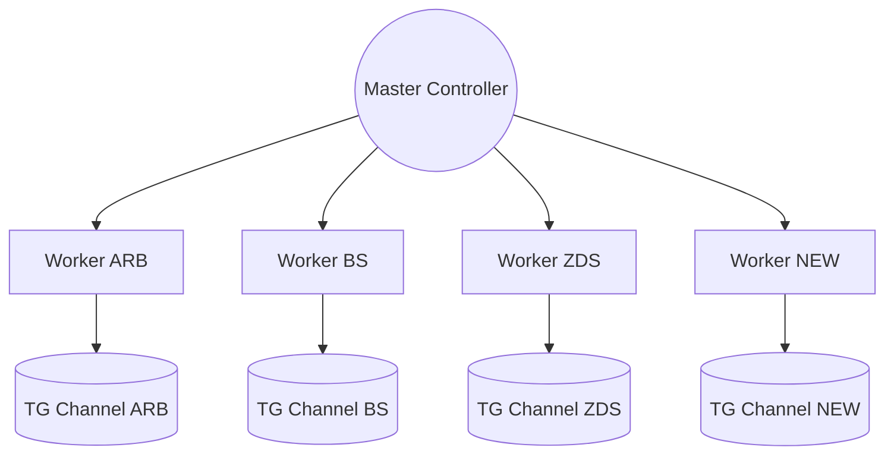

# SCALING_GUIDE.md — Developer Blueprint for RoboVAI v2.0

## Architecture Recap

Hub-and-Spoke with one Master Controller and N Worker Bots. Each worker is an independent Telegram bot with its own token, feeds, persona, and mode (NATIVE/FUNNEL/DUAL).

## SOP: Adding a New Brand (5-Minute Protocol)

1. Provision Token & Channel

- Create a new Telegram Bot (BotFather) and channel; add bot as admin.
- Collect: `TELEGRAM_TOKEN_NEW`, `CHANNEL_ID_NEW`.

2. Add credentials to `.env`

- Append:
  - `TELEGRAM_TOKEN_NEW=...`
  - `CHANNEL_ID_NEW=...`
  - Any platform keys (e.g., DISCORD_WEBHOOK_URL_NEW, DEVTO_API_KEY_NEW).

3. Define Persona & Strategy in `brands_config.py`

- Add a persona in `PERSONA_PROMPTS` (tone, rules, strict “NO links” clause).
- Add feeds to `BRAND_FEEDS`.
- Add a `BrandConfig` block in `get_brand_configs()` with mode, schedule, platforms.

4. Restart System

- `python launcher.py --async` (preferred) or restart the service.
- Verify via Master dashboard that the new worker shows online.

## API Load Balancing (Groq/NVIDIA keys)

- Rotate keys in `.env` (GROQ_API_KEY, GROQ_API_KEY_2, ...). Update the AI provider manager to round-robin if traffic grows.
- Monitor quota usage; if workers increase, lower per-call `max_tokens` or raise temperature only where needed.
- Consider per-brand key assignment to isolate quota impact.

## Server Specs for Scaling

- Up to 3-5 bots: 2 vCPU / 4 GB RAM is sufficient.
- ~10 bots: 4 vCPU / 8 GB RAM recommended.
- ~50 bots: 8-16 vCPU / 16-32 GB RAM; ensure stable network and ulimit for open connections.
- Storage: keep logs rotated; ensure fast disk if image generation is enabled.

## Operational Practices for Growth

- Stagger worker startups by a few hundred ms (already done) to avoid thundering herd on APIs.
- Enforce one polling instance per token to avoid `getUpdates` conflicts.
- Add per-brand backoff and alerting (already present) to catch crashes quickly.

## Future Roadmap Ideas

- Dockerize the stack for reproducible deploys (compose: master + workers).
- Add a web admin (FastAPI/Streamlit) alongside the Telegram Master for richer dashboards.
- Add distributed task queue (e.g., Celery/RQ) if external platforms grow.
- Implement autoscaling policy: spin up/down worker containers per brand load window.

## Checklist (Code Touchpoints)

- `.env`: new tokens/keys.
- `brands_config.py`: persona, feeds, mode, schedule, platforms.
- Optional: add platform publishers if new channels are needed.
- Restart and validate via Master dashboard and alerts.
